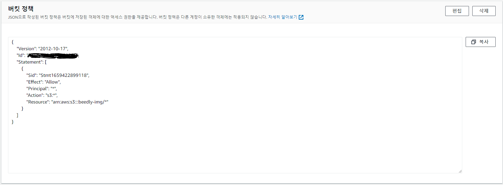
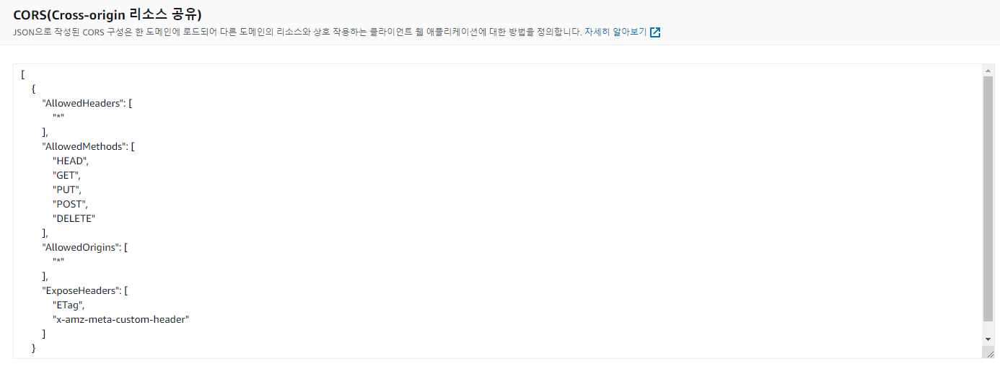
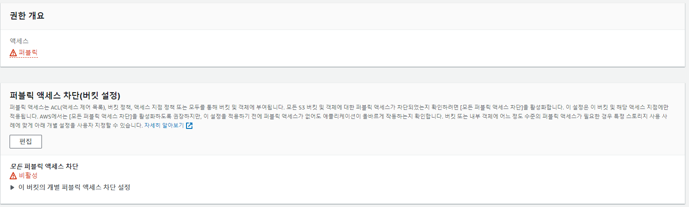
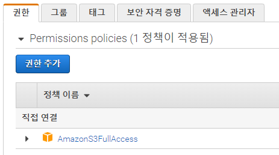
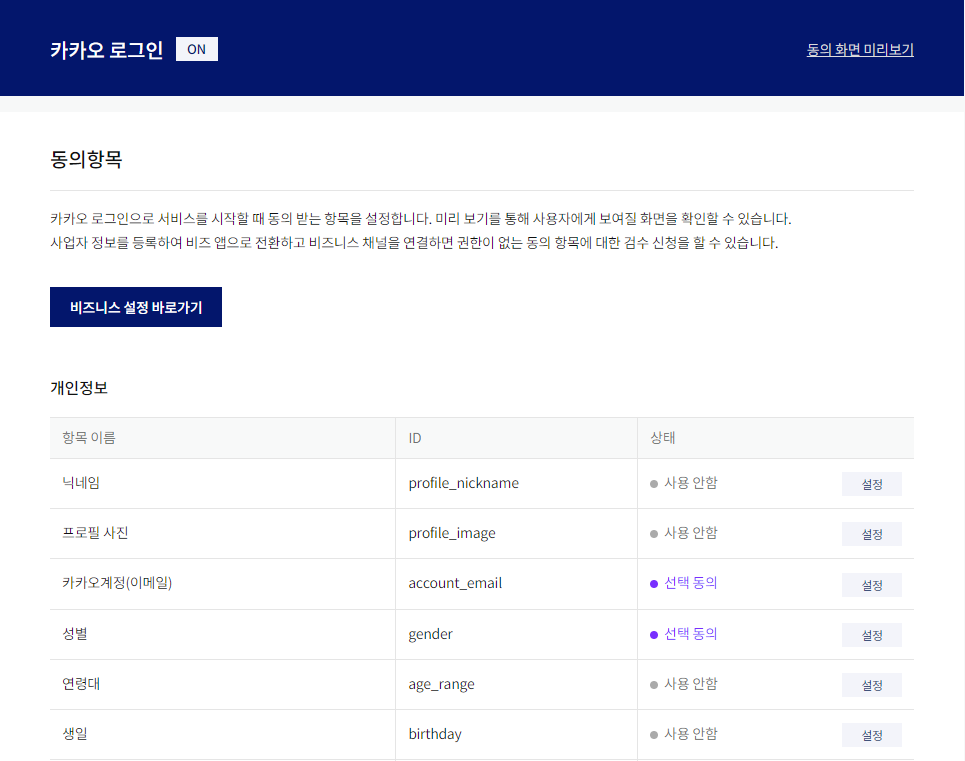

# 2. 프로젝트에서 사용하는 외부 서비스 정보를 정리한 문서

# AWS S3

- 상품 이미지 및 작가 프로필, 배경 이미지 등록 시 이미지를 저장하는 객체 스토리지
- [https://aws.amazon.com/ko/s3/getting-started](https://aws.amazon.com/ko/s3/getting-started/)
- 버킷 권한 설정

- IAM 설정
  - 사용자 추가 후 권한 설정

# 카카오 로그인 API

- 카카오 계정으로 서비스에 로그인할 수 있도록 하는 OAuth 2.0 기반의 소셜 로그인 서비스
- [https://developers.kakao.com/docs/latest/ko/kakaologin/common](https://developers.kakao.com/docs/latest/ko/kakaologin/common)
- beedly에서 필요한 동의 항목(카카오계정(이메일), 성별)

# OpenVidu

- 웹 기반 화상 기능
- [https://openvidu.io](https://openvidu.io/)

# Color Picker API

- 등록한 작품 사진의 컬러를 뽑아 고유한 점수를 부여
- [https://colorpicker.easylogic.studio/ko/image/api.html#palette](https://colorpicker.easylogic.studio/ko/image/api.html#palette)
